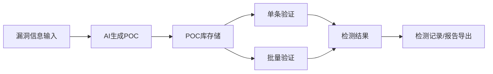
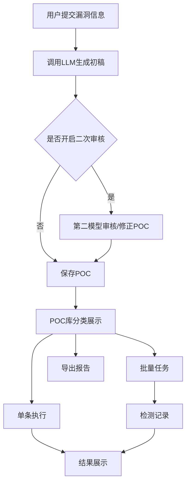
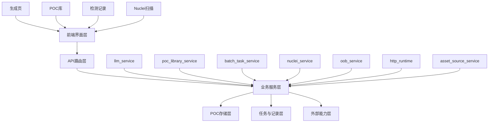
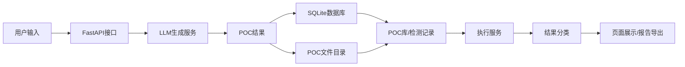
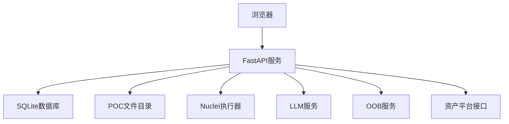

# AI-POC 项目开题文档

## 1. 需求分析

### 1.1 项目背景

当前 Web 漏洞验证工作中，POC 编写、调试、管理和复用往往依赖人工完成，存在生成效率低、验证条件不统一、历史结果难追踪的问题。`AI-POC` 项目面向这一场景，尝试构建一个以 AI 生成 POC 为核心、兼容多种验证方式的漏洞验证平台，实现从漏洞信息输入、POC 自动生成、验证执行到检测记录沉淀的完整流程。

### 1.2 需求概述

系统需要解决四类核心需求：一是根据有限漏洞信息自动生成验证型 POC；二是将生成结果统一保存、分类、执行与复用；三是支持单条验证、批量验证、检测记录与导出；四是兼容直接验证、带参验证、人工指南和 Nuclei 模板等多种执行形态，提升实际验证成功率与可维护性。

### 1.3 需求分析图

---

## 2. 功能流程设计

### 2.1 总体流程

系统整体流程为：用户输入漏洞描述或请求数据，平台调用大模型生成 POC，并根据执行模式将其保存为可直接验证、带参验证或人工指南。随后用户可在 POC 库中执行验证、查看代码、进行批量测试或导出报告。对于适合外带验证的漏洞，系统还可通过 OOB 能力辅助判断命中情况。

### 2.2 功能流程图

### 2.3 核心功能说明

- 智能生成：支持漏洞描述、CVE、HTTP 请求信息等输入，生成 Python POC、Nuclei 兼容结果或人工指南。
- POC 管理：支持分类、搜索、查看代码、删除、执行与复用。
- 验证执行：支持直接验证、带参验证、人工指南和 OOB 验证。
- 批量检测：支持 URL 批量输入、POC 选择、任务队列、状态查询和报告导出。
- Nuclei 兼容：支持即时扫描与任务化扫描，但整体仍以 AI 生成和管理 POC 为核心。

---

## 3. 结构设计

### 3.1 系统模块结构图

### 3.2 数据流图

### 3.3 数据库及存储设计

系统采用 SQLite 与文件目录混合存储方式。结构化元数据、任务记录、统计信息保存在数据库中，POC 代码、Nuclei 模板、批量结果明细与配置文件按目录保存。该方式实现简单、便于本地演示和课程项目部署，同时便于后期扩展为更完整的服务端存储方案。

### 3.4 主要数据表清单

| 表名 | 作用 |
| --- | --- |
| `poc_records` | 保存生成后的 POC 基本信息、执行模式、验证方式、文件路径与统计数据 |
| `batch_tasks` | 保存批量检测任务总览、状态、统计信息、时间信息 |
| `batch_task_items` | 保存每个最小任务单元的执行结果、分类、详情摘要 |

### 3.5 目录结构说明

| 目录 | 作用 |
| --- | --- |
| `api/` | 路由接口定义 |
| `services/` | 业务逻辑与运行时能力 |
| `models/` | 请求/响应数据模型 |
| `frontend/` | 页面与交互逻辑 |
| `pocs/` | POC 文件、数据库、元数据与模板目录 |
| `tests/` | 自动化测试代码 |
| `docs/` | 项目分析、计划与测试报告 |

---

## 4. 交互设计

### 4.1 页面交互设计

系统前端主要由四个页面区域组成：生成页、POC 库、检测记录和 Nuclei 扫描页。生成页负责输入漏洞信息和模型配置；POC 库负责分类、执行和管理；检测记录负责查看任务日志与导出报告；Nuclei 页用于兼容模板扫描。整体采用统一导航，尽量保持低学习成本，便于非专业用户理解主要流程。

### 4.2 模块交互设计

前端通过 REST API 与后端交互。生成功能调用大模型服务并返回结构化结果；POC 执行调用统一执行入口；批量检测通过任务接口异步运行并在检测记录页轮询显示状态；Nuclei 兼容扫描则通过独立配置页创建任务或即时扫描。模块之间通过服务层隔离，减少页面直接耦合业务实现。

### 4.3 网络交互设计

系统主要采用浏览器与 FastAPI 后端的本地 HTTP 通信。后端根据配置决定是否调用外部 LLM、OOB 服务和资产平台接口。对于批量任务和扫描任务，系统通过异步执行与状态查询接口实现“提交任务-查看进度-查看结果”的交互方式，避免长请求阻塞页面。

---

## 5. 运行部署环境设计

### 5.1 运行环境

项目当前面向 Windows 本地环境，后端采用 Python 3.11 + FastAPI，前端采用原生 HTML、CSS 与 JavaScript，POC 元数据使用 SQLite 存储。系统支持本地便携包方式分发，适合课程展示与演示环境；如需完整体验 AI 生成、OOB 和空间测绘导入功能，则需要额外配置对应外部服务参数。

### 5.2 部署结构图

### 5.3 部署方式说明

项目支持两种部署方式：一是开发环境下直接运行源码，适合继续开发与测试；二是将完整目录、虚拟环境与启动脚本打包为 Windows 便携版，适合课程答辩、朋友演示和非技术用户体验。后者无需自行安装 Python 环境，能更直观展示系统功能。

---

## 6. 技术重难点及依据

| 技术点 | 难点说明 | 解决思路/依据 |
| --- | --- | --- |
| AI 生成 POC | 大模型输出不稳定，可能出现 JSON 错误、依赖缺失、验证逻辑过窄 | 通过 Prompt 约束、二次审核、依赖预检、失败分类提升生成质量 |
| 多执行模式兼容 | 需要同时支持 `url_only`、`url_with_params`、`manual_guide` | 统一执行元数据模型，前后端按执行模式联动 |
| 批量任务管理 | 需要处理 URL × POC 的笛卡尔积任务，兼顾状态、导出和取消 | 采用 `batch_tasks` + `batch_task_items` 两级任务模型 |
| 结果可解释性 | 仅返回“失败”不利于调试与修复 | 引入结构化失败分类，区分网络、环境、代码、OOB 等问题 |
| Nuclei 兼容 | 需要兼容现有模板执行，但不能喧宾夺主 | 保持 Nuclei 作为兼容执行器，上层统一进入检测记录体系 |
| 演示与部署 | 非技术用户环境不稳定，课程展示成本高 | 支持便携版打包，使用启动脚本与本地静态资源降低部署复杂度 |

---

## 7. 项目总结

`AI-POC` 项目的研究重点不在于单纯兼容某个扫描器，而在于构建一个以 AI 生成与管理 POC 为核心的漏洞验证平台。项目已具备生成、审核、管理、验证、批量任务、报告导出、OOB 支持与 Nuclei 兼容等能力，具备较完整的系统形态。对于课程设计或学期项目而言，该项目具备较强的实践性、工程性和扩展空间，适合作为一个中大型软件工程实践课题。
